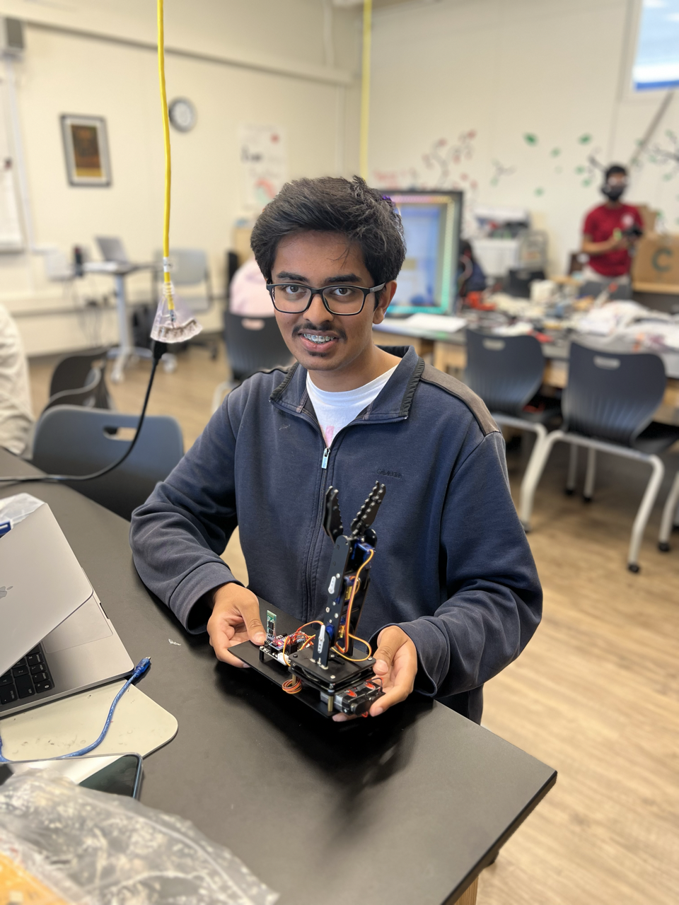

# Phone-Controlled Robot Arm
<!--Replace this text with a brief description (2-3 sentences) of your project. This description should draw the reader in and make them interested in what you've built. You can include what the biggest challenges, takeaways, and triumphs from completing the project were. As you complete your portfolio, remember your audience is less familiar than you are with all that your project entails!

You should comment out all portions of your portfolio that you have not completed yet, as well as any instructions:

This is an HTML comment in Markdown 
Anything between these symbols will not render on the published site-->

| **Engineer** | **School** | **Area of Interest** | **Grade** |
|:--:|:--:|:--:|:--:|
| Krishna D. | American High | Software Engineering/Design | Rising Sophomore

<!--**Replace the BlueStamp logo below with an image of yourself and your completed project. Follow the guide [here](https://tomcam.github.io/least-github-pages/adding-images-github-pages-site.html) if you need help.**-->

<center></center>
  
# Final Milestone

<iframe width="560" height="315" src="https://www.youtube.com/embed/N1oYvTIMfxk" title="YouTube video player" frameborder="0" allow="accelerometer; autoplay; clipboard-write; encrypted-media; gyroscope; picture-in-picture; web-share" allowfullscreen></iframe>

## Summary
My intensive project is the Phone-Controlled Robot Arm. For my Final Milestone, I changed and redesigned the way the app operates, allowing the robot to run smoother.

### Components Used
- SG90 Servos: Rotate 180 degrees to move and joints and claw of the arm
- Bluetooth Module: Sends and recieves data from other devices wirelessly<br>

With the original app, the signals sent between the app, the Bluetooth Module, and the Arduino were arrays from slider buttons, like "s1120". Each symbol was read by my code, and with slider buttons, many of these arrays were sent in one drag of a button. This meant that the movements were lagged and random since so much text was sent that user input was often missed. By using two up and down buttons for each servo, you can control specific values that are more fixed. The buttons now send a particular number, like "2" to the Arduino. The code then uses that to place the value into an integer m. Using while loops, m is matched to a specific servo movement, which either adds or subtracts one from the servo's position. This means when you press the up button once, the servo moves up once, and when you press the down button once, the servo moves down once. Holding the buttons down is also possible, since m stays the same since the last button was pushed. With more shorter, fixed values in place, the Arduino can read every user input easily, meaning the movements are smoother than before.

## Challenges Faced
The challenges with this stage were a combination of code and my servos. Another reason my robot wasn't running smoothly was because my servos weren't calibrated properly. This resulted in Servo 4, the claw, heating up from constantly running its motors into its other claw. I had to replace Servo 4 and properly calibrate the other servos by removing them, setting their position to 90 degrees, and then attaching the components in the correct position. Another problem was the attachment of my wooden component holding Servo 2 to the base. It was attached by attaching a screw into a groove with a bolt, keeping the component in place. The groove on mine snapped, but I simply just superglued it into the base. Another problem I faced was integrating my robot with the new code. My robot was reading the values, but it wasn't giving the integer m the corresponding value. I fixed this by adding if statements in my app code for button release(with m=0) to make sure that when the button released, the value stopped.

## Next Steps
I have to complete my Demo Night at Bluestamp. For my project, I would like to make the entire project more compact, maybe by stacking the Arduino under the Robot's base. Another idea would be to make a control not of buttons, but of a diagram of the actual robot arm that I can drag with the components.

# Second Milestone

<iframe width="560" height="315" src="https://www.youtube.com/embed/npnLhE6dR6U" title="YouTube video player" frameborder="0" allow="accelerometer; autoplay; clipboard-write; encrypted-media; gyroscope; picture-in-picture; web-share" allowfullscreen></iframe>

<!--<iframe width="560" height="315" src="https://www.youtube.com/embed/y3VAmNlER5Y" title="YouTube video player" frameborder="0" allow="accelerometer; autoplay; clipboard-write; encrypted-media; gyroscope; picture-in-picture; web-share" allowfullscreen></iframe>-->

<!--For your second milestone, explain what you've worked on since your previous milestone. You can highlight:
- Technical details of what you've accomplished and how they contribute to the final goal
- What has been surprising about the project so far
- Previous challenges you faced that you overcame
- What needs to be completed before your final milestone-->

## Summary
My intensive project is a Phone-Controlled Robot Arm. Now, instead of using a wired controller, the user can control the robot using their phone with an app to move forward, backward, right, and left.

### Components Used
- Bluetooth Module: Sends and recieves data from other devices wirelessly
- JST Connectors: Use a JST battery pin to connect the Arduino to two 9V batteries<br>

With the Bluetooth Module connected to the RX and TX pins of the Arduino, devices nearby can connect and transmit messages through signals to the Arduino. The app on the phone uses slider buttons, which sends a signal in the form of the servo number and its amount of movement. The code in the Arduino reads the signal's starting servo number and moves the servo based on the following numerical value. For example, s1120 means the user slid the waist slider button and servo-1 moves to 120/180 degrees. The JST connectors replace the old wire connectors and 9V battery pin. With two 9V battery pins soldered to the JST connector, the Arduino gets the same voltage but more current to power it.

## Challenges Faced
Most challenges in this project occured with the code. The initial tutorial's code for their robot arm wouldn't work for mine due to different designs, meaning I had to adjust multiple functions and handle different libraries to fit my robot. Another challenge was cleaning the string so my signal could be read. With newline characters between some of my signals, and functions that read one character at a time, the original functions wouldn't read the app. I had to add semicolons to the end of my signals so that each different signal movement was read and updated, not on seperate lines. Another challenge I faced was the power source, but I realized that my 9V batteries didn't last very long and one battery wasn't enough current for the Arduino.

## Next Steps
For my Final Milestone, I aim to make my robot much more compact and organized and customize the app code so that my robot runs more smoothly.

# First Milestone

<!--**Don't forget to replace the text below with the embedding for your milestone video. Go to Youtube, click Share -> Embed, and copy and paste the code to replace what's below.**-->

<iframe width="560" height="315" src="https://www.youtube.com/embed/XQz-tYDIEzE" title="YouTube video player" frameborder="0" allow="accelerometer; autoplay; clipboard-write; encrypted-media; gyroscope; picture-in-picture; web-share" allowfullscreen></iframe>

<!--For your first milestone, describe what your project is and how you plan to build it. You can include:
- An explanation about the different components of your project and how they will all integrate together
- Technical progress you've made so far
- Challenges you're facing and solving in your future milestones
- What your plan is to complete your project-->
## Summary
My intensive project is the phone-controlled robot arm. Using a wired controller with thumbsticks, the user can control the robot to move forward, backward, right, and left to grab objects with its expanding claws. 
### Components Used
- Arduino Nano: Stores the code that controls the arm and utilizes pins to connect and manage different components
- Servo 1(MG90): Rotates left and right to move the entire robot around at the base
- Servos 2, 3, 4(SG90): Rotate left and right to control the joints and claws of the arm
- Joysticks: Uses left, right, top, and bottom movements of the thumbstick to controll the arm's movements
- Turntable: Small metal balls between two plates allow it to rotate 360 degrees at the base
- 9V battery & clip: Powers the Arduino
- Wooden cutouts: Make up the physical parts needed for the arm; the claws, the joints, the base <br>

When you plug the battery clip into the 9V, the robot powers up and the Arduino lights up. The user hold the wired controller and moves the thumbsticks in specific gestures to control the arm. For the left joystick, up moves the arm forward, right moves the based counter-clockwise, down moves the arm backward, and left moves the base clockwise. With Servo 1 screwed into the wooden base and turntable, it allows the rest of the components above it to move left and right with the servo movement. Servo 2 allows for forward and backward movements, since its fixed to the wooden arm. For the right joystick, up closes the claw, down expands the claw, left starts recording an action, and right peforms the recorded action. Servo 4, at the top of the arm, moves one of the claws. Geared against the other claw, both claws move in opposite directions simultaneously. Each time a joystick has input, the Arduino uses its uploaded code to match it to a function and transmit an electronic signal to the servos, which move.

## Challenges Faced
The components of the project depend mostly on screws and stacked in an upward position, meaning although the initial installation is easy, fixing any past errors means disassembling multiple components below it. Another challenge I faced was initially using the servos; I realized you need to adjust servos 90 degrees before installation.

## Next Steps 
Coding the Android app for the arm and creating custom functions for Servo 3 in the Arduino code.

# Starter Project

<iframe width="560" height="315" src="https://www.youtube.com/embed/CaBMmpWIf28" title="YouTube video player" frameborder="0" allow="accelerometer; autoplay; clipboard-write; encrypted-media; gyroscope; picture-in-picture; web-share" allowfullscreen></iframe>

## Summary
My starter project was a digital clock with an alarm. With the clock, you can customize the hours and minutes of the display and set alarms for specific times. The clock beeps when the user presses a button or the alarm time has come.
### Components Used
- Microcontroller: Coded to manage the circuit and its different components
- Crystal: Keeps track of the time set to change the display with minutes and hours
- Buttons: Enable the user to control the time displayed and set alarms based on different combinations of presses
- Buzzer: Plays a beeping sound to notify the use of a change in settings or an alarm
- Triode: Amplifies the audio and radio signals
- Ceramic/Electrolytic Capacitors: Store and release electrical energy to control different parts of the circuit
- Transistors - Amplify and direct electronic signals
- Display - Shows the four digits for the time
- AA batteries & holder: Power the circuit <br>

For the user to adjust the time and set and alarm, they have to use the two buttons at K1 and K2. When you press the button in a certain combination, the microcontroller runs its code based on the button input to change the digits in the display. Using the different types of At the same time, the microcontroller sends an audio signal to the buzzer, which the triode amplifies and the buzzer plays. When the user long presses K2 and saves their time settings, the crystal starts to track time. Every sixty seconds, the minute digit with change, and every 60 minutes, the hour digit will change in the display. Transistors assist in generally controlling user input and the crystal to send to the microcontroller. The capacitors help supply electrical energy towards different components like the buzzer or display based on the microcontroller and button input.

## Challenges Faced
Most components in the project require soldering, and being a beginner to soldering, my first attempts didn't go well. I overheated the soldering iron, soldered with too much material, and scratched the fiberglass of my first board trying to desolder. I also had a hard time distinguishing between what to solder and what to not. I learned that many of my challenges came from not cleaning the iron's tip and not being able to put conductive material on the tip.

## Next Steps
I have to start on my main project, the Phone-Controlled Robotic Arm. I have to build the arm, adjust the components and code, and develop/connect and app to the physical build.

# Schematics 
<center></img></center>


# Code
<!--Here's where you'll put your code. The syntax below places it into a block of code. Follow the guide [here]([url](https://www.markdownguide.org/extended-syntax/)) to learn how to customize it to your project needs.-->

```c++
void setup() {
  arm.ServoAttach(4,5,6,7);
  arm.JoyStickAttach(A0,A1,A2,A3);
  pinMode(buzzerPin,OUTPUT);
  Serial.begin(9600);
  delay(20);
  servo1PPos = 90;
  arm.servo1.write(servo1PPos);
  servo2PPos = 90;
  arm.servo2.write(servo2PPos);
  servo3PPos = 90;
  arm.servo3.write(servo3PPos);
  servo4PPos = 45;
  arm.servo4.write(servo4PPos);
}

void loop() {
   if (Serial.available() > 0) {
  dataIn = Serial.read(); 
  }
    if (dataIn == 0) {
      m = 0;
    }
    if (dataIn == 1) {
      m = 1;
    }
    if (dataIn == 2) {
      m = 2;
    }
    if (dataIn == 3) {
      m = 3;
    }
    if (dataIn == 4) {
      m = 4;
    }
    if (dataIn == 5) {
      m = 5;
    }
    if (dataIn == 6) {
      m = 6;
    }
    if (dataIn == 7) {
      m = 7;
    }
    if (dataIn == 8) {
      m = 8;
    }
    if (dataIn == 9) {
      m = 9;
    }
    if (dataIn == 10) {
      m = 10;
    }
    if (dataIn == 11) {
      m = 11;
    }
    if (dataIn == 12) {
      m = 12;
    }
    if (dataIn == 13) {
      m = 13;
    }

  Serial.println(m);

    while (m == 10){
      flag = 1;
      if (Serial.available() > 0) {
        m = Serial.read();
      }
      delay(speedDelay);
    }
  
  if (flag == 1){
      while (m == 1) {
        if (Serial.available() > 0) {
          m = Serial.read();
        }
        arm.servo1.write(servo1PPos);
        if (servo1PPos > 0){
          servo1PPos--; 
        }
        delay(speedDelay);
      }

      while (m == 2) {
        if (Serial.available() > 0) {
          m = Serial.read();
        }
        arm.servo1.write(servo1PPos);
        if (servo1PPos < 180){
          servo1PPos++; 
        }
        delay(speedDelay);
      }

      while (m == 3) {
        if (Serial.available() > 0) {
          m = Serial.read();
        }
        arm.servo2.write(servo2PPos);
        if (servo2PPos > 0){
          servo2PPos--; 
        }
        delay(speedDelay);
      }

      while (m == 4) {
        if (Serial.available() > 0) {
          m = Serial.read();
        }
        arm.servo2.write(servo2PPos);
        if (servo2PPos < 180){
          servo2PPos++; 
        }
        delay(speedDelay);
      }

      while (m == 5) {
        if (Serial.available() > 0) {
          m = Serial.read();
        }
        arm.servo3.write(servo3PPos);
        if (servo3PPos > 0){
          servo3PPos--; 
        }
        delay(speedDelay);
      }

      while (m == 6) {
        if (Serial.available() > 0) {
          m = Serial.read();
        }
        arm.servo3.write(servo3PPos);
        if (servo3PPos < 180){
          servo3PPos++; 
        }
        delay(speedDelay);
      }

      while (m == 7) {
        if (Serial.available() > 0) {
          m = Serial.read();
        }
        arm.servo4.write(servo4PPos);
        if (servo4PPos > 0){
          servo4PPos--; 
        }
        delay(speedDelay);
      }

      while (m == 8) {
        if (Serial.available() > 0) {
          m = Serial.read();
        }
        arm.servo4.write(servo4PPos);
        if (servo4PPos < 90){
          servo4PPos++; 
        }
        delay(speedDelay);
      }

      while (m == 9){
        flag = 0;
        if (Serial.available() > 0) {
          m = Serial.read();
        }
        delay(speedDelay);
      }

      while (m == 11){
        if (Serial.available() > 0) {
          m = Serial.read();
        }
        arm.servo1.write(90);
        arm.servo2.write(90);
        arm.servo3.write(90);
        arm.servo4.write(90);
        delay(speedDelay);
      }

      while (m == 13){
          if (Serial.available() > 0) {
          m = Serial.read();
        }
        if (speedDelay > 10){
          speedDelay--;
        }
      }

      while (m == 12){
          if (Serial.available() > 0) {
          m = Serial.read();
        }
        if (speedDelay < 30){
          speedDelay++;
}
```

# Bill of Materials
<!--Here's where you'll list the parts in your project. To add more rows, just copy and paste the example rows below.
Don't forget to place the link of where to buy each component inside the quotation marks in the corresponding row after href =. Follow the guide [here]([url](https://www.markdownguide.org/extended-syntax/)) to learn how to customize this to your project needs.-->

| **Part** | **Note** | **Price** | **Link** |
|:--:|:--:|:--:|:--:|
| Arduino Nano | Managing and controlling the robot's components | $24.90 | <a href="https://store-usa.arduino.cc/products/arduino-nano?selectedStore=us"> Link </a> |
| Bluetooth Module | Sending and processing signals between the app and the Arduino | $7.99 | <a href="https://www.microcenter.com/product/656628/HC-05_Bluetooth_Transmission_Module_for_Arduino_Bottom_Master_Slave"> Link </a> |
| SG90 Servos | Moving the joints and wooden components | $16.95 | <a href="https://www.amazon.com/American-Robotic-Supply-Authentic-Digital/dp/B0783NS32R/ref=sr_1_4?keywords=tower+pro+sg90&qid=1689780732&sr=8-4"> Link </a> |
| MG90 Servos | Moving the base | $10.99 | <a href="https://www.amazon.com/MG90S-Servo-Motor-Helicopter-Arduino/dp/B07L6FZVT1"> Link </a> |
| 9V Batteries | Powering the Arduino and Bluetooth Module | $6.58 | <a href="https://www.amazon.com/Energizer-Alkaline-General-Purpose-Battery/dp/B00003IE4E"> Link </a> |
| JST Battery Connectors | Connect the 9V batteries to the circuit's battery pin | $8.99 | <a href="https://www.amazon.com/daier-Micro-2-Pin-Connector-Female/dp/B01DUC1O68"> Link </a> |
| Female to Female Connectors | Connecting the Arduino to the wired controller | $6.98 | <a href="https://www.amazon.com/EDGELEC-Breadboard-1pin-1pin-Connector-Multicolored/dp/B07GD312VG/ref=sr_1_4?crid=11X4PIA5EMMZO&keywords=female+to+female+connectors&qid=1689781475&s=industrial&sprefix=female+to+female+connector%2Cindustrial%2C150&sr=1-4"> Link </a> |
| Joysticks | Allow the user to control the robot using a controller | $9.95 | <a href="https://tinkersphere.com/buttons-switches/922-joystick-breakout-module-arduino-raspberry-pi-compatible.html"> Link </a> |

# Other Resources/Examples
One of the best parts about Github is that you can view how other people set up their own work. Here are some past BSE portfolios that are awesome examples. You can view how they set up their portfolio, and you can view their index.md files to understand how they implemented different portfolio components.
- [Example 1](https:///YimingJiaBlueStamp/)
- [Example 2](https://sviatil0.github.io/Sviatoslav_BSE/)
- [Example 3](https://arneshkumar.github.io/arneshbluestamp/)

To watch the BSE tutorial on how to create a portfolio, click here.-->
